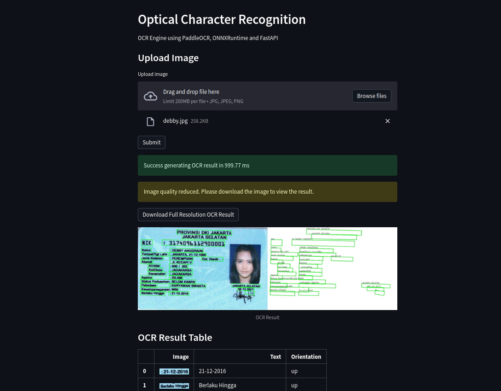

# Vision OCR



## Introduction
Vision OCR is an optical character recognition tool that uses the [PaddleOCR](https://github.com/PaddlePaddle/PaddleOCR) model to extract text from image. At this moment, we only support [ONNX Runtime](https://onnxruntime.ai/) as the backend for PaddleOCR model.

## Getting Started
### Prerequisites
We assume you have **docker** installed on you machine. If not, you can install it from [here](https://docs.docker.com/get-docker/). Also, you need to have installed the **NVIDIA Container Toolkit** to run the docker container with GPU support (at this moment we don't support it yet). You can install it from [here](https://docs.nvidia.com/datacenter/cloud-native/container-toolkit/latest/install-guide.html).

### Development
For development, we will use [devcontainer](https://code.visualstudio.com/docs/devcontainers/containers) to create a development environment. So, you need to have **Visual Studio Code** installed on your machine. If not, you can install it from [here](https://code.visualstudio.com/). Also, you need to have the **Remote - Containers** extension installed on your Visual Studio Code. If not, you can install it from [here](https://marketplace.visualstudio.com/items?itemName=ms-vscode-remote.remote-containers).

Next, you need to clone the repository to your local machine by:
```bash
git clone https://github.com/ruhyadi/vision-ocr
```
There is two type of devcontainer you can choose: `gpu-devel` and `cpu-devel`. If you have a GPU (not supported yet), you can choose `gpu-devel` and if you don't have a GPU, you can choose `cpu-devel`. You can choose the devcontainer by pressing `F1` and type `Remote-Containers: Rebuild Container` (or `Reopen in Container`). Then, choose the devcontainer you want to use.

After that, you will directly enter the devcontainer and you can start developing the project.

### Production
For use the vision-ocr in production, you only need to pull the docker image from docker hub. There are two type of docker image you can choose: `api` and `app`. The `api` image is used to run the vision-ocr as a RESTful API and the `app` image is used to run the vision-ocr simple dashboard (built on streamlit). Available tags detailed below:

| Name                            | Version | PaddleOCR version | ONNXRuntime              | Description                                                |
| ------------------------------- | ------- | ----------------- | ------------------------ | ---------------------------------------------------------- |
| `ruhyadi/vision-ocr:v1.0.0-api` | 1.0.0   | v3                | :heavy_check_mark: (CPU) | Initial release, only support CPU provider for ONNXRuntime |
| `ruhyadi/vision-ocr:v1.0.0-app` | 1.0.0   | -                 | -                        | Streamlit dashboard for Vision OCR                         |

You can pull the docker image by:
```bash
# pull the api image
docker pull ruhyadi/vision-ocr:v1.0.0-api

# pull the app image
docker pull ruhyadi/vision-ocr:v1.0.0-app
```

After that, you can run the docker container by:
```bash
# run the api image
docker run \
    -d \
    -p 4700:4700 \
    --name vision-ocr \
    ruhyadi/vision-ocr:v1.0.0 \
    python src/main.py

# run the app image
docker run \
    -d \
    -p 4701:4701 \
    --name vision-ocr \
    ruhyadi/vision-ocr:v1.0.0-app
```

You can open the dashboard by open your browser and go to `http://localhost:4701`, or you can open the API swagger documentation by open your browser and go to `http://localhost:4700`.

#### API Endpoints
The engine provides the following API endpoints:
- `POST/api/v1/engine/ocr/snapshot`: Extract text from image.

You can use `curl` to test the API. For example:
```bash
curl -X 'POST' \
  'http://localhost:4700/api/v1/engine/ocr/snapshot' \
  -H 'accept: application/json' \
  -H 'Content-Type: multipart/form-data' \
  -F 'image=@/PATH/TO/IMAGE.jpg;type=image/jpeg'
```
Please replace `/PATH/TO/IMAGE.jpg` with the path to the image you want to extract the text.

The API will return the following example response:
```json
{
  "boxes": [
    [10, 10, 20, 20, 30, 30, 40, 40],
    [50, 50, 60, 60, 70, 70, 80, 80]
  ],
  "texts": [
    "Hello",
    "World"
  ],
  "oris": [
    "up",
    "down",
  ],
  "scores": [
    0.99,
    0.98
  ]
}
```
## Troubleshooting
### Convert PaddleOCR model to ONNX
In order to convert the PaddleOCR model to ONNX, you need to install `paddle2onnx` by:
```bash
pip install paddle2onnx
```
Next, you need to download the PaddleOCR model, please refer to the [PaddleOCR documentation](https://github.com/PaddlePaddle/PaddleOCR) for more information. For example, you can download the PaddleOCR model by:
```bash
# download detection model
wget https://paddleocr.bj.bcebos.com/PP-OCRv3/english/en_PP-OCRv3_det_infer.tar
tar -xvf en_PP-OCRv3_det_infer.tar

# download recognition model
wget https://paddleocr.bj.bcebos.com/PP-OCRv3/english/en_PP-OCRv3_rec_infer.tar
tar -xvf en_PP-OCRv3_rec_infer.tar

# downlaod orientaiton classifier model
wget https://paddleocr.bj.bcebos.com/dygraph_v2.0/ch/ch_ppocr_mobile_v2.0_cls_infer.tar
tar -xvf ch_ppocr_mobile_v2.0_cls_infer.tar
```
After that, you can convert the PaddleOCR model to ONNX by:
```bash
# convert detection model
paddle2onnx --model_dir ./en_PP-OCRv3_det_infer \
    --model_filename inference.pdmodel \
    --params_filename inference.pdiparams \
    --save_file ./ocr_det.onnx \
    --opset_version 11 \
    --input_shape_dict="{'x':[-1,3,-1,-1]}" \
    --enable_onnx_checker True

# convert recognition model
paddle2onnx --model_dir ./en_PP-OCRv3_rec_infer \
    --model_filename inference.pdmodel \
    --params_filename inference.pdiparams \
    --save_file ./ocr_rec.onnx \
    --opset_version 11 \
    --input_shape_dict="{'image':[-1,3,48,-1]}" \
    --enable_onnx_checker True

# convert orientation classifier model
paddle2onnx --model_dir ./ch_ppocr_mobile_v2.0_cls_infer \
    --model_filename inference.pdmodel \
    --params_filename inference.pdiparams \
    --save_file ./ocr_ori.onnx \
    --opset_version 11 \
    --input_shape_dict="{'image':[-1,3,48,-1]}" \
    --enable_onnx_checker True
```


## Acknowledgement
- [PaddleOCR](https://github.com/PaddlePaddle/PaddleOCR): Awesome multilingual OCR toolkits based on PaddlePaddle.
- [ONNXRuntime](https://onnxruntime.ai/): Open source high performance inference engine for ONNX models.
- [FastAPI](https://fastapi.tiangolo.com/): Modern, fast (high-performance), web framework for building APIs with Python.